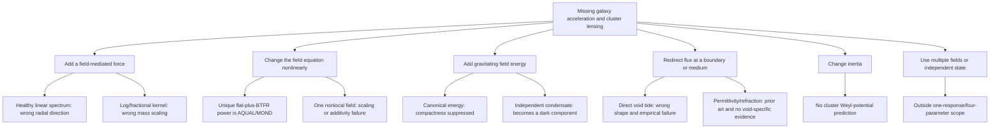

# Negative void-gravity possibility closure

## Outcome

No candidate survives the complete set of premises imposed on this research
angle:

- baryons and cosmological boundary data are the only source inputs;
- no independent gravitating dark component;
- no MOND/AQUAL galaxy equation;
- one universal physical metric;
- no per-object or object-class force parameters;
- at most four new global physical parameters;
- positive kinetic and gradient energies; and
- the same theory predicts resolved dynamics and lensing.

This is not a proof that every mathematical modification of gravity is false.
It is an exhaustive closure of the declared weak-field mechanism classes.  A new
proposal must now identify which premise it changes and which already-tested
scaling or sign argument it genuinely evades; changing constants inside a rejected
class is not a new possibility.

The machine-readable synthesis is
`results/nbm0_possibility_closure/report.json`.

## Why the search is finite

For a finite baryonic source, the missing outer acceleration must arise through
one of a small number of weak-field mechanisms:



Scalar, vector, torsion, nonmetricity, bimetric, higher-derivative, and emergent
descriptions can use different mathematical language, but their static weak-field
prediction still enters one or more of these mechanisms.

## Results that close the branches

### 1. Reciprocity removes a free source strength

For the physical metric

$$
\tilde g_{\mu\nu}=e^{2\alpha X}
(g_{\mu\nu}+2\beta XU_\mu U_\nu),
$$

variation of the matter action fixes the cold-matter source to
$d=\alpha-\beta$.  A canonical point source then has

$$
A_{\rm dyn}=2d^2,
\qquad
A_{\rm lens}=-\beta d,
\qquad
q=-{\beta\over2d}.
$$

The independent $\kappa_X$ in the preliminary equation is not physical in this
minimal action.  Only $(A_{\rm dyn},L_X,q)$ are observable, and an ideal joint
synthetic data set recovers all three with a well-conditioned Jacobian.  The
problem is therefore not an inability to estimate the constants; it is the shape
of the resulting force.

### 2. Every healthy linear Yukawa spectrum has the wrong radial behavior

For nonnegative exchange amplitudes,

$$
E(r)=1+\sum_i A_i(1+r/L_i)e^{-r/L_i}
$$

decreases with radius.  Since $v_c^2=GME(r)/r$,

$$
{d\ln v_c\over d\ln r}\le-{1\over2}.
$$

The numerical spectrum scan reached a maximum slope of -0.500010.  Increasing
the coupling or adding ranges cannot produce a flat outer curve; negative
spectral weight would reverse the inequality by introducing a ghost or repulsive
mode.

### 3. The nonlinear scaling is unique

For a spherical flux law

$$
\nabla\cdot(|\boldsymbol g|^{m-1}\boldsymbol g)\propto\rho,
$$

Gauss' law gives $g\propto M^{1/m}r^{-2/m}$.  Flat speed and
$v_{\rm flat}^4\propto M$ simultaneously require $m=2$, hence

$$
\nabla\cdot(|\nabla\Phi|\nabla\Phi)\propto\rho.
$$

That is the deep AQUAL/MOND equation.  Calling its coefficient a void pressure
does not create a new galaxy mechanism.  A linear fractional $p=3/2$ operator
does make a logarithmic potential, but then linear mass charge predicts
$v_{\rm flat}^4\propto M^2$.

### 4. Canonical basin energy cannot provide cluster lensing

For a canonical scalar outside a source of radius $R$,

$$
{E_X\over Mc^2}=d^2{GM\over Rc^2}.
$$

Galaxy and cluster compactnesses are only about $10^{-6}$ and $10^{-5}$.
Accumulating field energy equal to five baryonic masses would require dynamical
fifth-force amplitudes $A_{\rm dyn}=2d^2$ of $10^7$ and $10^6$, respectively.
That contradicts the order-unity missing-acceleration target before Solar-System
constraints are considered.  A condensate with an independent cosmological energy
reservoir could lens and cluster, but it is then a gravitating dark sector even if
its microscopic interpretation is vacuum structure rather than a particle.

### 5. The constitutive-boundary loophole is not identified as a void effect

Perfect confinement of gravitational flux to a slab of half-height $h$ gives

$$
g={GM\over hr},\qquad v_{\rm flat}^2={GM\over h}.
$$

This is a genuine way to obtain $1/r$ acceleration without an additive force.
It is also established prior art in Refracted Gravity, not an original project
formula.

For 123 quality-screened SPARC galaxies, the inverted effective heights span
0.299--18.136 kpc with median 3.361 kpc; the median $h/R_d$ is 1.287.  A model
using non-kinematic disk structure predicts held-out flat speeds with 0.0970 dex
scatter.  That initially passed the 0.10-dex continuation threshold, but the
required confounding control is much better: a mass-only BTFR predictor has
0.0635 dex scatter.  The boundary model is 52.8% worse and therefore does not
independently identify a physical boundary.

Adding the measured CF4 void score worsens boundary-height RMSE by 0.7%; the
permutation value is $p=0.564$.  Thus this data set supplies no evidence that the
putative boundary is controlled by surrounding voids.  At the outermost CLASH
summary point, the spherical required permittivity has median 0.117 and central
90% range 0.084--0.177, but those values come from GR/NFW-derived summaries and
are not a theory-neutral lensing fit.

The known Refracted Gravity benchmark remains separate.  Its published
covariant completion is a scalar-tensor theory, and a recent two-cluster
kinematic analysis reported mutually inconsistent parameter sets and tension
with other scales.  These are prior-art results, not findings created here:
[original galaxy/cluster proposal](https://arxiv.org/abs/1603.04943),
[covariant completion](https://arxiv.org/abs/2109.11217), and
[two-cluster universality test](https://arxiv.org/abs/2410.19698).

## Mechanism disposition

| Weak-field mechanism | Result under fixed premises | What would have to change |
|---|---|---|
| Healthy additive field/spectrum | Rejected | Negative spectral weight or nonlinear screening |
| Local nonlinear flux | Retired | Permit the MOND/AQUAL galaxy limit |
| Single nonlinear/nonlocal field | Rejected within one-state scope | Add independently evolving state variables |
| Direct external void force/tide | Rejected | Measure a new non-smooth boundary variable |
| Canonical self-gravitating basin energy | Rejected | Add an independent energy reservoir |
| Constitutive/refraction boundary | Not void-identified; prior-art benchmark only | Measure boundary/permittivity directly and derive reciprocal action |
| Modified inertia | Rejected for unification | Supply a universal relativistic lensing metric |
| Multi-field hybrid | Not tested under fixed scope | First establish its dimensionality from same-system data |

## What remains scientifically open

There is no honest formula left that satisfies all current restrictions.  The
next advance requires relaxing one premise explicitly:

1. **Self-gravitating basin medium.**  Permit a vacuum/condensate energy reservoir
   that clusters and lenses.  This is the most direct route to cluster lensing,
   but it must be acknowledged as a dark component rather than pure negative
   gravity.
2. **Relativistic MOND plus a cluster component.**  Permit the unique galaxy
   nonlinear limit and derive, rather than fit, the additional cluster source.
3. **Multi-response gravity.**  Permit more than one latent field only after raw
   same-object dynamics and lensing show that one response is insufficient.
4. **Measurement first.**  Complete at least ten systems with overlapping
   baryonic profiles, resolved dynamics, raw/rerunnable lensing likelihoods, and
   joint covariance before choosing among those relaxations.

Given the user's goal of predicting both star speeds and cluster lensing without
relabeling MOND, option 4 is the defensible immediate action.  If a theory branch
must be selected before those data exist, option 1 has the clearest lensing path
but changes the no-dark-component premise.

## Reproduction

```powershell
$env:PYTHONPATH='src'
python scripts/explore_nbm0_action_space.py
python scripts/explore_nbm0_survivors.py
python scripts/explore_nbm0_constitutive_basin.py
python scripts/synthesize_nbm0_possibility_closure.py
python -m pytest -q tests/test_basin_metric.py tests/test_basin_action.py tests/test_basin_survivors.py tests/test_basin_permittivity.py
```
