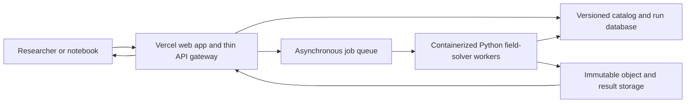

# Public simulator and researcher API plan

## Product boundary

The hosted service will expose frozen versions of the same observation-matched
galaxy/cluster objects and field solvers used by the repository. A researcher
will be able to select a real object, generate a controlled synthetic object,
submit a formula, and receive predictions and comparator scores with a complete
reproducibility manifest.

It will not present exploratory formulas as established physics, silently fit
one gravity setting per galaxy, or execute arbitrary user Python in the main
API process.

## Deployment architecture

Vercel is well suited to the documentation, interactive front end, request
validation, authentication, and short catalog calls. The 3D AQUAL runs already
take tens of seconds on a 65-cubed grid and larger experiments can take much
longer, so production solves should be asynchronous workers rather than a web
function held open. The worker can initially run on Modal or as a Cloud Run
job. Cloud Run jobs support independently parallel tasks and long task
timeouts; Modal exposes FastAPI-compatible web functions and also documents
restricted/single-use execution for untrusted code.

Current platform references:

- Vercel function limits: <https://vercel.com/docs/functions/limitations>
- Cloud Run jobs: <https://cloud.google.com/run/docs/create-jobs>
- Modal web functions: <https://modal.com/docs/guide/webhooks>
- Modal restricted functions: <https://modal.com/docs/guide/restricted-access>

## Version 1 API

| Method and path | Purpose |
|---|---|
| `GET /v1/datasets` | list frozen datasets, licenses, evidence class, and hashes |
| `GET /v1/galaxies` | filter real galaxies by morphology, mass, gas fraction, or survey |
| `GET /v1/galaxies/{id}` | return metadata and links to permitted mass-map products |
| `GET /v1/clusters` | list cluster maps and available raw-constraint score packs |
| `POST /v1/galaxies/synthetic` | create a seeded observation-matched galaxy from declared parameters |
| `POST /v1/models/validate` | parse and dimension-check a submitted equation without running it |
| `POST /v1/runs` | submit one formula/object/method request and return a run ID |
| `GET /v1/runs/{id}` | return state, logs, parameter accounting, scores, and artifact links |
| `POST /v1/batches` | evaluate one frozen formula on a declared sample/holdout |

## Formula interface

The default submission format should be a small, dimension-aware expression
language serialized as JSON, not `eval` and not unrestricted Python. A formula
declares:

- its inputs, such as baryonic density, Newtonian potential, acceleration,
  density gradients, tidal tensor, or globally measured invariants;
- its universal constants with units and allowed domains;
- a local constitutive expression or a supported divergence/Poisson operator;
- whether the prediction is for massive tracers, photons, or both;
- whether a metric and Solar-System limit are actually derived.

The validator constructs an abstract syntax tree, rejects unknown functions and
dimensionally inconsistent expressions, counts free parameters, and hashes the
canonical form. The worker translates only that safe tree into array
operations. This supports most proposed acceleration and transport laws while
making identical formulas hash-identical.

An advanced later tier can accept a container or Python plug-in, but only in an
isolated, network-disabled, single-use sandbox with strict CPU, memory, time,
and output limits. Those runs must be labeled separately from equation-language
runs because arbitrary implementations are harder to audit.

## Every run must return

- formula canonical form and SHA-256;
- simulator, solver, dataset, and object version hashes;
- random seed and numerical grid/boundary settings;
- universal and per-object parameter counts shown separately;
- convergence and conservation diagnostics;
- predictions before any observed target values are disclosed when running a
  registered holdout;
- galaxy, cluster, topology, and Solar scores kept separate;
- comparator results from the same inputs (Newtonian, frozen MOND/RAR, and
  declared halo fit);
- machine-readable JSON/CSV and human-readable plots;
- a permanent run ID and citation-ready manifest.

## Delivery stages

1. Stabilize serializable `GalaxyMap`, `ClusterMap`, `Formula`, `RunSpec`, and
   `RunResult` schemas in the Python package.
2. Wrap the existing deterministic simulator in a local FastAPI service and
   generate an OpenAPI contract plus Python client.
3. Add the safe equation parser, unit checker, parameter counter, and a small
   conformance suite of Newtonian/MOND formulas.
4. Add asynchronous jobs, immutable artifacts, content-addressed caching, rate
   limits, and authenticated preregistered holdouts.
5. Deploy the front end/gateway to Vercel and the solver container to the chosen
   compute backend; publish a public staging URL.
6. Invite a small external replication group, retain every failed run, and fix
   usability issues without changing frozen scientific scores.
7. Version and publish the production API, SDK, examples, data licenses, model
   cards, and citation instructions.

The deployment follows the final scientific rejection audit, but schema and
serialization decisions begin during map ingestion so the hosted simulator is
the tested research engine rather than a separate rewrite.
