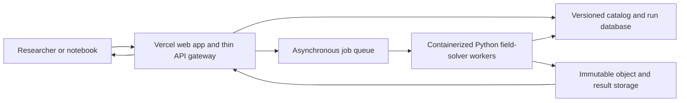

# Public simulator and researcher API plan

## Product boundary

The hosted service will expose frozen versions of the same observation-matched
galaxy/cluster objects and field solvers used by the repository. A researcher
will be able to select a real object, generate a controlled synthetic object,
submit a formula, and receive predictions and comparator scores with a complete
reproducibility manifest.

It will not present exploratory formulas as established physics, silently fit
one gravity setting per galaxy, or execute arbitrary user Python in the main
API process.

## Implemented hosted preview (2026-08-02)

The first Vercel-ready control plane is implemented in
[`../hosted-simulator`](../hosted-simulator/README.md). This is a functional
radial benchmark rather than a mock interface:

- the generated, content-hashed catalog contains all 175 SPARC systems and
  3,391 published rotation-curve points;
- `GET` calls list or retrieve systems and dataset provenance;
- a deterministic radial synthetic-galaxy endpoint accepts mass, gas fraction,
  bulge fraction, disk scale, noise, and seed;
- a bounded JSON expression tree performs symbol, dimension, complexity, and
  parameter-policy checks without `eval` or submitted source code;
- formula runs return the submitted prediction, fixed simple-MOND and
  Newtonian comparators, universal/per-object parameter counts, full curves,
  caveats, and content-addressed formula/run hashes; and
- requests for 2D/3D fields or raw lensing return `worker_not_connected` rather
  than substituting an algebraic radial proxy.

Ten catalog, formula, API, reproducibility, and simulator tests pass. The web
application and serverless routes are deployed in the Horizon3 Vercel team at
<https://sigma-gravity-research-simulator-five.vercel.app>. A production smoke
run reproduced the local formula hash, run ID, manifest hash, full DDO154 point
arrays, and comparator scores. No credential was written to disk.

## Deployment architecture



Vercel is well suited to the documentation, interactive front end, request
validation, authentication, and short catalog calls. It should not own the
scientific process. The 3D AQUAL runs already take tens of seconds on a
65-cubed grid; the current P0657 full lens score takes about 39 seconds, and the
217-by-217 P0654 exact-fold run took 244 to 286 seconds on the development
machine. Batches, larger grids, and uploaded formulas can run much longer.

As verified on 2026-08-02, Vercel Fluid Compute documents maximum function
durations of 300 seconds on Hobby and 800 seconds on Pro/Enterprise. Those
limits can technically contain some current runs, but tying billing,
reliability, and HTTP lifetime to a scientific optimizer remains the wrong
architecture. The gateway should enqueue immediately and return `202 Accepted`.

The worker can initially run on Modal or as a Cloud Run job. Cloud Run jobs
default to a ten-minute task timeout and document configurable task timeouts up
to seven days. Modal Sandboxes can block all outbound networking and mount a
restricted dataset/result volume, which is appropriate only for a later
arbitrary-code tier. The safe formula language does not need an untrusted-code
sandbox.

Current platform references:

- Vercel function duration: <https://vercel.com/docs/functions/configuring-functions/duration>
- Cloud Run jobs: <https://cloud.google.com/run/docs/create-jobs>
- Cloud Run task timeout: <https://cloud.google.com/run/docs/configuring/task-timeout>
- Modal web functions: <https://modal.com/docs/guide/webhooks>
- Modal Sandbox networking: <https://modal.com/docs/guide/sandbox-networking>

## Version 1 API

The draft machine-readable contract is
[`../api/openapi.yaml`](../api/openapi.yaml). It is intentionally asynchronous:
large numerical calls return `202 Accepted` and a job identifier.

| Method and path | Purpose |
|---|---|
| `GET /v1/datasets` | list frozen datasets, licenses, evidence class, and hashes |
| `GET /v1/galaxies` | filter real galaxies by morphology, mass, gas fraction, or survey |
| `GET /v1/galaxies/{id}` | return metadata and links to permitted mass-map products |
| `GET /v1/clusters` | list cluster maps and available raw-constraint score packs |
| `GET /v1/clusters/{id}` | return one cluster's map versions, observable packs, and sealed/open status |
| `POST /v1/galaxies/synthetic` | create a seeded observation-matched galaxy from declared parameters |
| `POST /v1/clusters/synthetic` | create a controlled multi-component cluster without claiming observational identity |
| `POST /v1/models/validate` | parse and dimension-check a submitted equation without running it |
| `POST /v1/models` | register a validated canonical formula and return its immutable model ID |
| `GET /v1/models/{id}` | return canonical equation, units, parameter count, provenance, and prior runs |
| `POST /v1/runs` | submit one formula/object/method request and return a run ID |
| `GET /v1/runs/{id}` | return state, logs, parameter accounting, scores, and artifact links |
| `GET /v1/runs/{id}/events` | stream queued/running/scoring/final lifecycle events |
| `POST /v1/batches` | evaluate one frozen formula on a declared sample/holdout |

A minimal run request is explicit and content-addressable:

```json
{
  "model_id": "mdl_sha256_...",
  "object": {"kind": "galaxy", "id": "DDO154", "version": "map_sha256_..."},
  "solver": {"id": "qumond_2d", "version": "solver_sha256_...", "grid": "native"},
  "observables": ["velocity_field", "rotation_curve"],
  "comparators": ["newtonian", "mond_rar_fixed", "declared_halo_fit"],
  "seed": 154
}
```

The immediate response contains a run ID, an existing cached run ID when every
hash matches, and URLs for status/events. It never waits for the field solve.

## Formula interface

The default submission format should be a small, dimension-aware expression
language serialized as JSON, not `eval` and not unrestricted Python. A formula
declares:

- its inputs, such as baryonic density, Newtonian potential, acceleration,
  density gradients, tidal tensor, or globally measured invariants;
- its universal constants with units and allowed domains;
- a local constitutive expression or a supported divergence/Poisson operator;
- whether the prediction is for massive tracers, photons, or both;
- whether a metric and Solar-System limit are actually derived.

The validator constructs an abstract syntax tree, rejects unknown functions and
dimensionally inconsistent expressions, counts free parameters, and hashes the
canonical form. The worker translates only that safe tree into array
operations. This supports most proposed acceleration and transport laws while
making identical formulas hash-identical.

An advanced later tier can accept a container or Python plug-in, but only in an
isolated, network-disabled, single-use sandbox with strict CPU, memory, time,
and output limits. Those runs must be labeled separately from equation-language
runs because arbitrary implementations are harder to audit.

The first formula language should cover the mechanisms actually exercised in
this repository: algebraic acceleration laws, divergence-form constitutive
laws, Poisson/AQUAL/QUMOND solves, local tensor closures, path averages,
conservative deposition, and self-adjoint graph diffusion. A researcher should
compose these from supported typed operators; they should not submit a string
that is passed to Python.

## Every run must return

- formula canonical form and SHA-256;
- simulator, solver, dataset, and object version hashes;
- random seed and numerical grid/boundary settings;
- universal and per-object parameter counts shown separately;
- convergence and conservation diagnostics;
- predictions before any observed target values are disclosed when running a
  registered holdout;
- galaxy, cluster, topology, and Solar scores kept separate;
- comparator results from the same inputs (Newtonian, frozen MOND/RAR, and
  declared halo fit);
- machine-readable JSON/CSV and human-readable plots;
- a permanent run ID and citation-ready manifest.

## Current implementation readiness

| Layer | Reusable now | Required before hosting |
|---|---|---|
| Object catalog | hosted 175-system SPARC radial release; real galaxy maps, observation-matched replicas, raw cluster component maps | add map/cluster releases with enforceable license and sealed/open flags |
| Solvers | Newtonian Poisson, AQUAL, QUMOND, lens/root and transport operators | stable serializable request/result wrappers and resource estimates |
| Comparators | hosted Newtonian and fixed simple-MOND radial comparators; declared lens baselines | uniform field/lens comparator worker interface |
| Reproducibility | hosted formula/run hashes, frozen JSON protocols, CSV/JSON/PNG artifacts, regression tests | durable content-addressed artifact store and signed run manifest |
| Formula submission | bounded dimension-aware AST, unit checker, canonicalizer, parameter counter, operator allowlist | translate field/PDE operators to immutable worker jobs |
| Execution | deterministic hosted radial engine and local scientific CLI runs | queue, worker image, cancellation, quotas, caching, and event stream |
| Public UI/API | live Horizon3 Vercel UI and serverless radial API; local and production smoke tests pass | user auth/quotas, SDK, durable run storage, and worker connection |

P0652 through P0677 and P0711 through P0714 are useful API fixtures. They include successful numerical
invariants, real 2D-to-3D baryonic maps, Poisson/AQUAL/QUMOND solves, coefficient
passes, failed predictive gates, exact root-topology failures, tensor-orientation
comparisons, and a 400-attempt solver audit. The hosted conformance suite should
reproduce these negative results exactly; retaining failed runs is a product
requirement, not clutter.

P0711-P0714 add especially important public states: a galaxy gate that passes,
a pixel diagnostic whose comparator ordering needs interpretation, a cluster
sample that is `not_ready`, a critical-curve gate that is `not_observable`, and
a ready-subset field that loses multiple-image topology. The API must represent
each state directly rather than coercing it into one aggregate score.

## Delivery stages

1. Stabilize serializable `GalaxyMap`, `ClusterMap`, `Formula`, `RunSpec`, and
   `RunResult` schemas in the Python package. Include observed/synthetic,
   open/sealed, license, hash, units, coordinate frame, and uncertainty fields.
2. Put every current object and P0630-P0677 fixture into a versioned catalog.
   A catalog validation command must fail on missing license, hash, units, or
   provenance.
3. Wrap the existing deterministic simulator in a local FastAPI service and
   generate an OpenAPI contract plus Python client. First acceptance test:
   create a seeded replica, fetch a real galaxy by ID, submit fixed MOND, and
   reproduce the local P0632 result hashes.
4. Add the safe equation parser, unit checker, parameter counter, canonical
   hasher, and conformance formulas for Newtonian, fixed MOND/RAR, QUMOND,
   P0655 deposition, and P0657 diffusion. Invalid dimensions and per-object
   hidden parameters must be rejected before queueing.
5. Add asynchronous jobs with `queued`, `running`, `scoring`, `succeeded`,
   `failed`, and `cancelled` states; immutable artifacts; content-addressed
   caching; quotas; and authenticated preregistered holdouts. Identical run
   hashes must return the cached result without recomputation.
6. Containerize one CPU worker and benchmark small/medium/large resource
   classes. Deploy it first to Cloud Run Jobs or Modal; verify cancellation,
   retry idempotence, numerical determinism, and artifact survival.
7. Deploy the documentation/front end and thin gateway to Vercel. The browser
   must be able to search/call a specific galaxy, create a synthetic galaxy,
   validate/register a formula, submit a batch, follow events, and download a
   citation-ready result without holding an HTTP request open.
8. Add the optional arbitrary-code tier only after threat modeling. Run each
   submission in a network-blocked, single-use sandbox with read-only datasets,
   a per-run writable output path, and hard CPU/memory/time/output limits.
9. Invite a small external replication group, retain every failed run, and fix
   usability issues without changing frozen scientific scores.
10. Version and publish the production API, SDK, notebook examples, data
    licenses, model cards, uptime/support policy, and citation instructions.

Public-launch acceptance is stricter than “the endpoint works”: a clean worker
must reproduce selected local fixture hashes/tolerances, disclose every fitted
parameter, keep sealed outcomes inaccessible until protocol authorization,
and return a useful failure artifact when a formula diverges or loses roots.

The deployment follows the final scientific rejection audit, but schema and
serialization decisions begin during map ingestion so the hosted simulator is
the tested research engine rather than a separate rewrite.
