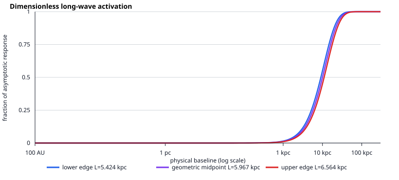

# Sigma V19BF long-wave scale-window results

## Decision

The long-wave premise passes a **dimensionless scale-separation precheck**. Under
the exact low-pass control already admitted by V19BE, one universal correlation
length can be practically constant across a planetary system, begin changing
inside a galaxy, and be nearly saturated across a large galaxy or cluster.

The intersection of the frozen constraints is

\[
\boxed{5.4243\ {\rm kpc}\le L_\Sigma\le6.5639\ {\rm kpc}},
\]

or, for the literal wavelength convention \(\lambda_\Sigma=2\pi L_\Sigma\),

\[
\boxed{34.082\ {\rm kpc}\le\lambda_\Sigma\le41.243\ {\rm kpc}}.
\]

This is not a measured interval and no point in it has been selected as a
Sigma constant. Both active bounds come from requiring the response at 10 kpc
to lie between 45% and 55% of its asymptotic value. The Solar constraint is
much weaker. The calculation therefore shows that the scales are compatible;
it does not show that nature chooses this scale.

## Frozen control response

The precheck uses

\[
f(r;L_\Sigma)=1-\left(1+{r\over L_\Sigma}\right)
e^{-r/L_\Sigma}.
\]

This is the fractional activation of the point-source low-pass control. It is
not being promoted to the final force law. At small baseline,

\[
f(r;L_\Sigma)=\frac12\left({r\over L_\Sigma}\right)^2
-\frac13\left({r\over L_\Sigma}\right)^3+\cdots,
\]

while a literal smooth metric wave has leading local tidal factor

\[
q_{\rm tidal}=\left({r\over2\pi L_\Sigma}\right)^2.
\]

The implementation evaluates the small-baseline series directly so the Solar
result is not lost to floating-point cancellation.

## What fixes the window

| Frozen preselection condition | Implied bound on \(L_\Sigma\) |
|---|---:|
| Low-pass activation at 100 AU \(\le10^{-12}\) | \(L_\Sigma\ge0.3428\) kpc |
| Literal tidal factor at 100 AU \(\le10^{-12}\) | \(L_\Sigma\ge0.0772\) kpc |
| Activation at 1 kpc \(\le0.05\) | \(L_\Sigma\ge2.8140\) kpc |
| Activation at 10 kpc \(\le0.55\) | **\(L_\Sigma\ge5.4243\) kpc** |
| Activation at 10 kpc \(\ge0.45\) | **\(L_\Sigma\le6.5639\) kpc** |
| Activation at 30 kpc \(\ge0.90\) | \(L_\Sigma\le7.7126\) kpc |

The planetary requirements leave a broad range. The narrow interval comes
entirely from the declared galactic transition location. This prevents a false
inference that Solar data have already measured a galactic wavelength.

## Six-kpc dimensional control

The earlier \(L_\Sigma=6\) kpc example lies inside the window. It remains an
illustration rather than a fitted constant.

| Baseline | Low-pass activation | Literal local tidal factor | Activation times unselected \(A=6\) control |
|---|---:|---:|---:|
| 100 AU | \(3.26\times10^{-15}\) | \(1.65\times10^{-16}\) | \(1.96\times10^{-14}\) |
| 1 pc | \(1.39\times10^{-8}\) | \(7.04\times10^{-10}\) | \(8.33\times10^{-8}\) |
| 1 kpc | 0.0124 | \(7.04\times10^{-4}\) | 0.0746 |
| 3 kpc | 0.0902 | 0.00633 | 0.541 |
| 10 kpc | 0.4963 | 0.0704 | 2.978 |
| 30 kpc | 0.9596 | 0.633 | 5.757 |
| 100 kpc | 0.999999 | not a small-baseline expansion | 5.99999 |

Multiplying by \(A=6\) is a sensitivity display only. It means “six times the
asymptotic extra-response channel,” not six times the total gravity, and it is
not a selected amplitude. A physical interpretation must wait for an action
that determines sign, normalization, source and metric response.

The literal wavelength crossing time over the derived interval is about
111,000--135,000 years. Such a mode would look quasistatic during human
observations, but that alone says nothing about its causal production or
gravitational-wave speed.



## What this establishes

1. “Longer than a stellar system” can be stated quantitatively without making
   the Solar and galaxy requirements inconsistent.
2. Planetary-scale uniformity is easy to obtain for any several-kpc
   correlation length; it does not finely tune the result.
3. A common transition near 10 kpc would imply a several-kpc correlation
   length and a literal wavelength of a few tens of kpc.
4. A single length would make a sharp cross-galaxy prediction: galaxies of very
   different baryonic size must not receive separately rescaled transition
   radii. That is where the premise can be falsified.

## What remains unproved

V19BF does not produce the root equation. It does not determine:

- whether the extra response is attractive;
- its amplitude, phase, polarization or source tensor;
- whether \(L_\Sigma\) is a propagation range, coherence length or wavelength;
- a covariant action or conserved field stress;
- the weak-field metric potentials \(\Psi\) and \(\Phi\);
- Cassini, Mercury, pulsar, radiation-loss or gravitational-wave compliance;
- galaxy rotation curves or raw cluster image topology.

In particular, the low-pass equation is already a Yukawa/STVG-like control in
its linear identity-source form. A viable Sigma successor must be the admitted
nonlinear, baryon-source-state-sensitive one-metric action, not a refit of this
control's length or amplitude. V19X gas-state completion remains the next input
before an action member can be selected.

## Reproduction

```powershell
python scripts/check_sigma_v19bf_long_wave_scale_window.py
python -m pytest tests/test_sigma_v19be_long_wave_action_admission.py tests/test_sigma_v19bf_long_wave_scale_window.py -q
```

The machine-readable report, 1,001-row sweep and vector plot are in
`results/sigma_v19bf_long_wave_scale_window/`.
